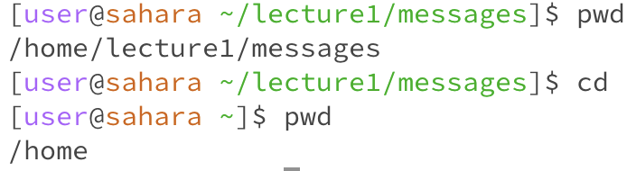
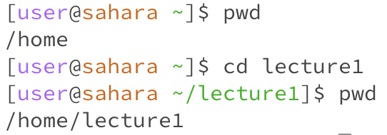
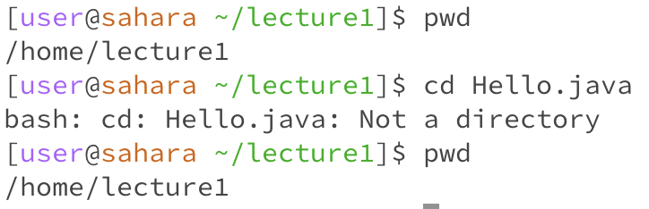
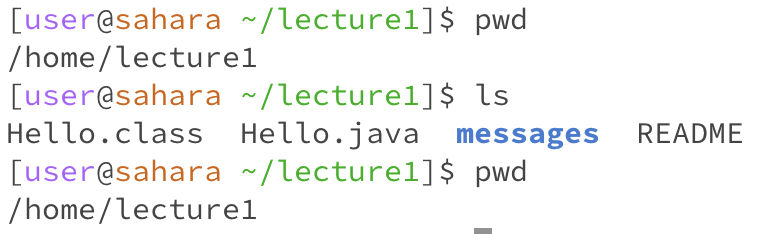
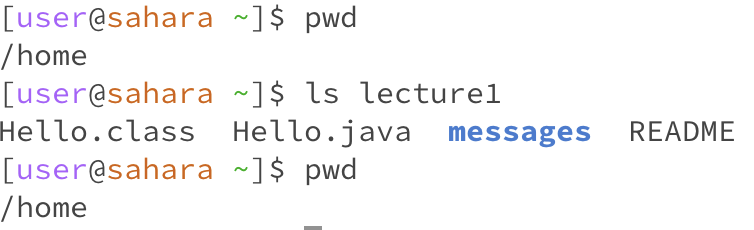
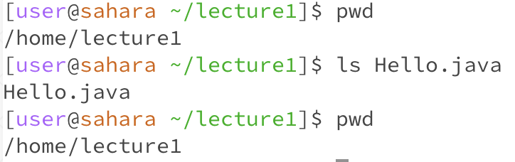
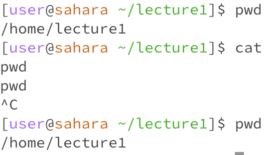
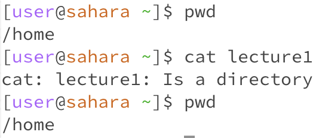
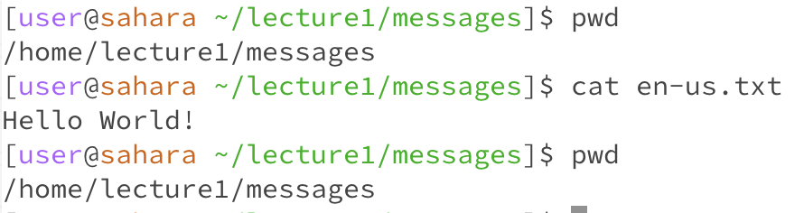

# Lab Report 1
## cd
* If no arguments are given, the directory will change to the home directory.\

* If a path to a directory is given as an argument, the directory will change to the current directory + the path to the directory given, assuming that the given path is inside the current directory. If the path isn't accessible, there will be an error message. \

* If a path to a file is given as an argument, this will result in an error because a file isn't a directory and therefore you can't change directory to a file. The terminal will print an error message saying that the argument is not a directory.\

## ls
* If no arguments are given, the terminal will print a list of all of the contents (files and folders) in that current directory. The folders will be bolded and blue. The command doesn't change the directory. \

* If a path to a directory is given as an argument, it will list the contents of that new directory without changing the current directory. This is assuming that the given path is accessible within the current directory. If the path isn't accessible, there will be an error message. \

* If a path to a file is given as an argument, then the terminal will print the file name, if the file is accessbile. If not, there will be an error message. \

## cat
* If no arguments are given, the command never finishes. Therefore, it will print back to you anything you enter into it. Typing control + c will quit the command. \

* If a path to a directory is given as an argument, this will result in an error, and the terminal will print and error message saying that the argument is a directory. This command can only print the contents of a file, so in order to see the contents of a folder, the `ls` command would be more suitable. \

* If a path to a file is given as an argument, the terminal will print the contents of that file, assuming the file is accessible within the current directory. If it is not accessible, there will be an error.\

