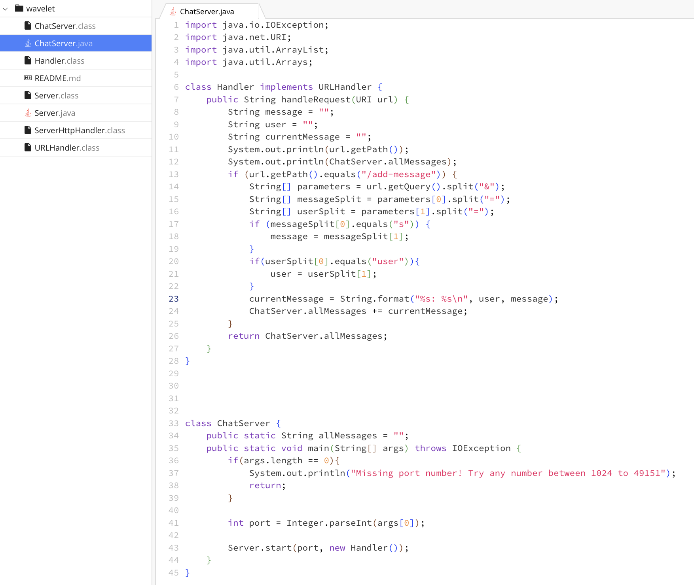
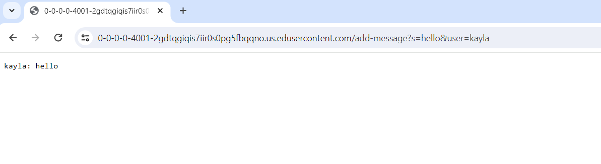
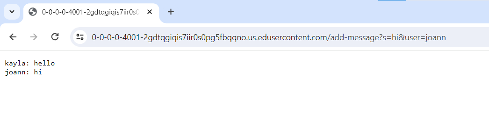
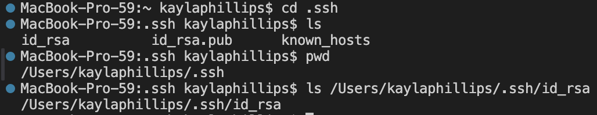
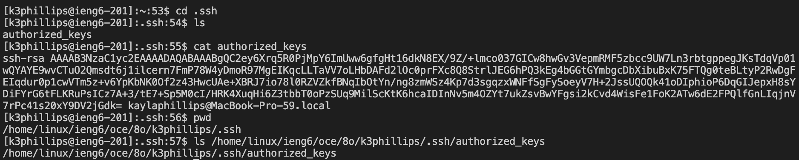
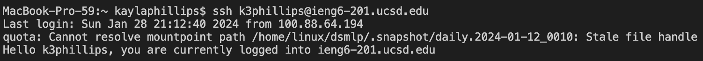

# Lab Report 2
## Part 1
## ChatServer Code

## ChatServer in Action

* First, the `main` method of the `ChatServer` class is called, the `allMessages` string is initialized and assigned to an empty string, and the `Server` is started given the port number from `args`. The `Server` then runs the `start` method which creates a new `Handler` object. The `url` from the server is passed in as an argument to the `handleRequest` method. Since the `url.getPath()` returns `add-message`, the components of the query are split into various arrays. In this case, `parameters` would be set to `{s=hello,user=kayla}`, `messageSplit` would be set to `{s,hello}`, `userSplit` would be set to `{user,kayla}`, `currentMessage` would be set to`kayla: hello\n`, and `allMessages` would also be set to `kayla: hello\n` which is returned and displayed onto the site. 

* Assuming the server is still running, the new request on the server would call the `handleRequest` method with the `url` passed in as an argument. The `message`, `user`, and `currentMessage` values are all reset to an empty string. In this case the url path is `add-message`, so `parameters` would be set to `{s=hi,user=joann}`, `messageSplit` would be set to `{s,hi}`, `userSplit` would be set to `{user,joann}`, and `currentMessage` would be set to `joann: hi\n`. `allMessages` would be updatesd to add `currentMessage`. The value of `allMessages` is now `kayla: hello\n joann: hi\n` which is returned and displayed onto the site. `allMessages` will only be reset if the server is stopped and restarted.

# Part 2
* The absolute path to the private key for my SSH key for logging into ieng6 is `/Users/kaylaphillips/-ssh/id_rsa`. 

* The absolute path to the public key for my SSH hey for logging into ieng6 is `/home/linux/ieng6/oce/80/k3phillips/.ssh/authorized_keys`. 

* Terminal interaction where I logged into my ieng6 account without being asked for a password. 

# Part 3
* I honestly didn't know most of the things we did in lab weeks 2 and 3 beforehand. I learned how to build and run a server and write code to handle different url requests. I also learned about remotely connecting to servers and how to use SSH keys to not have to enter my password every time when logging in.

