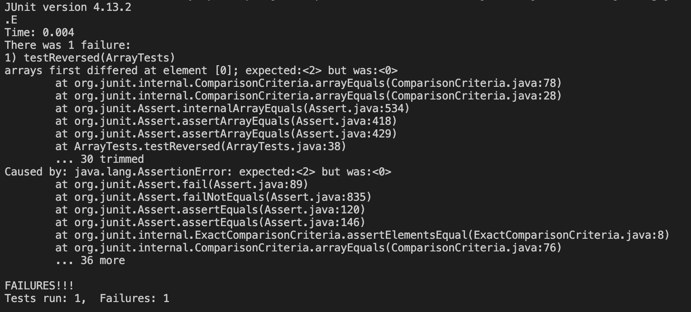
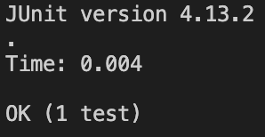

# Lab Report 3: Bugs and Commands
## Part 1: Bugs from Week 4 Lab
**Failure-Inducing Input**:
```
  @Test
  public void testReversedEvenLength() {
    int[] input2 = { 1,2 };
    assertArrayEquals(new int[]{ 2,1 }, ArrayExamples.reversed(input2));
  }
```
**Non-Failure-Inducing Input**:
```
  @Test
  public void testReversedEmptyArray() {
    int[] input1 = { };
    assertArrayEquals(new int[]{ }, ArrayExamples.reversed(input1));
  }
```
**Symptoms**:\
Failure Output\

Non-Failure Output\
 \
**Bug**:

Before:
```
  static int[] reversed(int[] arr) {
    int[] newArray = new int[arr.length];
    for(int i = 0; i < arr.length; i += 1) {
      arr[i] = newArray[arr.length - i - 1];
    }
    return arr;
  }
```
After:
```
  static int[] reversed(int[] arr) {
    int[] newArray = new int[arr.length];
    for(int i = 0; i < arr.length; i += 1) {
      newArray[i] = arr[arr.length - i - 1];
    }
    return newArray;
  }
```
Explanation: Before, the value of each index in the new, empty array was assigned to the indices of the original array, making all of the values zero. Simply switching the assignment by putting the original array values into the new array with the values' new positions will make the new array contain the reversed array. The last thing to fix is to then return the new, reversed array rather than the original array.

## Part 2: Researching Grep Commands
Source: https://man7.org/linux/man-pages/man1/grep.1.html#OPTIONS 

**Option 1: -c**
* -c or --count prints the number of lines that match the given pattern in the given file\
* This option is useful for simply knowing the frequency of a pattern without any specific information about each match.
* Example 1
```
grep -c "LSC" ./government/About_LSC/Comments_on_semiannual.txt 
79
```
* Example 2
```
grep -c "weight" ./biomed/1468-6708-3-1.txt
54
```
**Option 2: -v**
* -v or --invert-match prints the lines from the file that don't match the given pattern
* This option can be useful if there are a few lines that don't match a certain pattern
* Example 1
```
grep -v "the" ./government/Media/5_Legal_Groups.txt 


Vulnerable
Salt Lake City Tribune

BY EDWARD MCDONOUGH
Five independent Salt Lake organizations that provide legal
Legal Center at 205 N. 400 West is a project of "And Justice for
All," which, until this venture, has been a joint fund-raising
services. "And Justice for All," which solicits donations primarily
service law groups.
parking, something that's hard to find downtown and which has been
agencies about $375,000 each year. My assistant, Charity
efficient for those needing legal services. No longer will a woman
desperate for a protective order, for example, have to run all over
brick and stone interior walls were all hidden behind coverings and
Sweet Candy Company building for Tomax. The Olafsons are delighted
cost received so far. There still needed to be furnishings and
```
* Example 2
```
grep -v "a" ./plos/journal.pbio.0020001.txt 

  
    
      
        
        serious problems not only for the scientific community in the developing countries, but for
        
          
          
        
      
      
        2002).
        
          
          
        
      
      
      
      
        regions.
        In 
        However, publishing in 
      
      
        world.
        
          
          
        
        built.
```
**Option 3: -n**
* -n or --line-number prints the lines in the file that match the pattern and adds the line number before each line (1-based)
* This option is useful if it's important to know the line number of the pattern matches.
* Example 1
```
grep -n "service" ./government/Post_Rate_Comm/Cohenetal_comparison.txt 
22:Obligation (USO) is the last refuge of a postal service wishing to
24:inefficient service, opaque accounts, and large rents, many postal
26:only means of ensuring universal, affordable postal service for
32:that the cost of the USO is the cost of the services that would not
36:continued to provide universal service with no subsidy.
38:beyond ubiquitous service. It also includes a uniform price with
44:postal service should be treated
52:universal service provider because it imposes a surcharge for
55:Postal Service which is a universal service provider under the
59:bank accounts and internet service.2 Notwithstanding, we use this
60:restrictive definition of universal service for this paper.
61:The obligation to provide ubiquitous service is not in itself
64:the frequency of service on unprofitable routes to the point where
66:rationalize its prices by reflecting the cost of service to
73:levels of service. We use the term "burden of the USO" to
98:Many postal services are increasingly becoming primarily
120:discuss two measures of the cost of universal service, the entry
158:Prices of goods and services vary between Italy and the United
165:liras required in 1999 to buy goods and services equivalent to what
278:window services are common to the postal administrations of all
298:postal service. On the other hand, Poste Italiane per capita volume
388:burden of universal service is highly dependent on volume per
413:postal service does not require delivery; recipients pick up mail
418:A postal service has variable and fixed upstream costs as well
419:as variable and fixed delivery costs. In a breakeven postal service
473:pricing and service constraints given that routes have disparate
501:Class would be less likely to make use of a service with less
624:profitable. A postal service that is below breakeven will be less
626:a postal service is above breakeven, its routes will be even more
657:of a universal service provider and the limited amount of
679:its breakeven postal service to offset losses on unprofitable
681:USO. The postal service would then have a surplus. In order for the
682:postal service to return to breakeven, prices would be reduced. 25
698:The same logic would hold for a postal service earning any given
705:universal service.
```
* Example 2
```
grep -n "heart" ./biomed/1468-6708-3-10.txt 
11:        compare the rate of fatal coronary heart disease (CHD) or
45:        outpatient], heart failure [HF/treated in the hospital or
163:          either of these alone, without other indications of heart
```
**Option 4: -l**
* -l or --files-with-matches prints the name of each of the input files that contains the pattern
* This option is useful if only the file names matter and not specifics about the line that matched.
* Example 1
```
grep -l "fugitive" ./911report/*
./911report/chapter-2.txt
./911report/chapter-3.txt
./911report/chapter-8.txt
```
* Example 2
```
grep -l "reproduction" ./government/Env_Prot_Agen/*
./government/Env_Prot_Agen/1-3_meth_901.txt
./government/Env_Prot_Agen/atx1-6.txt
./government/Env_Prot_Agen/ctf1-6.txt
./government/Env_Prot_Agen/ctf7-10.txt
./government/Env_Prot_Agen/ctm4-10.txt
```
